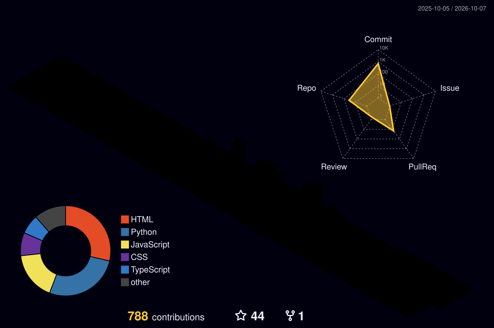

<!-- ═══════════════════════════════════════════════════════════════════════ -->
<!--                            HERO / IDENTITY                             -->
<!-- ═══════════════════════════════════════════════════════════════════════ -->

🧭 Engineering Profile
I build end-to-end software systems at the intersection of AI, data, web engineering and real-world problem solving.

I’m Sugata Nayak, an AI-focused Computer Science engineering student and full-stack developer from Kolkata. My work spans machine learning, computer vision, LLM applications, real-time dashboards, IoT pipelines and production-oriented web applications.
My goal is simple:
Don’t just build demos. Build systems that solve a problem, communicate their value, and can actually be deployed.
identity:
  name: Sugata Nayak
  focus: AI Engineering + Full-Stack Development
  education: Institute of Engineering & Management, Kolkata
  location: Kolkata, India

engineering:
  ai_ml: [Machine Learning, Computer Vision, NLP, LLM Apps]
  frontend: [React, JavaScript, HTML, CSS, Tailwind CSS, Three.js]
  backend: [Python, FastAPI, Flask, Node.js, Express.js, REST APIs]
  data: [PostgreSQL, MongoDB, SQLite, Pandas, NumPy]
  systems: [IoT, ESP32, Arduino, Raspberry Pi, Real-Time Pipelines]

mindset:
  - Ship end-to-end systems
  - Build around real user problems
  - Prefer measurable outcomes
  - Learn by engineering
⚡ At a Glance

🧠 AI / ML	🎯 UrbanNoiseNet	📦 Projects	🏅 Microsoft
AI + Full-Stack Focus	87.75% Classifier Accuracy	13 Built	3 Certifications / Badges
Computer Vision • NLP • LLM	8,732 Audio Samples	AI • Web • IoT	Azure AI + Applied Skills

Engineering Philosophy
Problem → Data → Model → API → Interface → Deployment → Impact

🧠 Core Technical Arsenal
💻 Languages

Python JavaScript Java C SQL
🎨 Frontend Engineering

React.js Three.js HTML5 CSS3 Tailwind CSS Vite
⚙️ Backend & APIs

Node.js Express.js Flask FastAPI REST APIs Firebase Supabase
🤖 AI / Machine Learning

Scikit-learn Pandas NumPy librosa MediaPipe LLaMA 3.3 Gemini API NLP Computer Vision
🗄️ Data & Persistence

MongoDB Atlas PostgreSQL SQLite
☁️ Dev Tools & Deployment

Git GitHub Vercel Render Postman
🔌 IoT & Hardware

Arduino ESP32 Raspberry Pi RFID GSM GPS Neo-6M
🚀 Featured Engineering

🏙️ UrbanNoiseNet — Smart City Acoustic Intelligence

Real-time urban noise monitoring + ML-based acoustic classification + civic enforcement workflow.
Audio Input
    ↓
MFCC Feature Extraction
    ↓
Random Forest Classifier
    ↓
Noise Source Classification
    ↓
Geofenced Threshold Analysis
    ↓
Civic Action / Challan / Dispatch / Complaint Workflow
Key engineering signal
- 87.75% audio-classification accuracy
- 8,732 UrbanSound8K samples
- MFCC-based feature extraction
- Random Forest trained from scratch
- React frontend + FastAPI backend
- Real-time civic workflow
- Geofencing + automated enforcement concepts
- Deployed frontend/backend architecture
Stack: Python FastAPI Scikit-learn librosa React Vercel Render
🛰️ SpaceAetherOS — Mission-Control for Space Data

A real-time space intelligence dashboard combining multiple live data sources into a unified mission-control interface.
Engineering highlights
- NASA + SpaceX + ISS + asteroid + news data
- Three.js visual experience
- Socket.io real-time ISS updates
- MongoDB persistence
- Gemini-powered AI Oracle
- React-based mission-control UI
Stack: React Three.js Node.js Socket.io MongoDB Gemini API
✋ AirCanvas AI — Touch-Free Human Computer Interaction

A computer-vision-powered whiteboard controlled entirely through hand gestures.
Highlights
- Fingertip-based drawing
- Gesture-controlled toolbar
- Pen + eraser
- Undo + save
- Touch-free interaction
- MediaPipe + OpenCV pipeline
Stack: Python OpenCV MediaPipe NumPy
🏥 MediFind AI — Emergency Hospital Recommender

An AI-assisted hospital recommendation platform designed to rank hospitals using multiple signals.
Ranking signals include
Rating Review Sentiment Distance Specialization Cost Bed Availability Wait Time Trust Score
Additional intelligence
- Isolation Forest for suspicious/fake-review filtering
- Triage classifier for specialization selection
- Leaflet-based location experience
- PostgreSQL-backed application
Stack: FastAPI Scikit-learn NLTK PostgreSQL React Leaflet
🧩 More Systems I've Built
System	Domain	Core Engineering
Emotional Aware Machine	Emotion AI + Music	face-api.js Gemini Node.js YouTube API
StudyBuddy.AI	EdTech + LLM	LLaMA 3.3 Groq Google Classroom API Node.js
CrisisConnect AI	Emergency Response	Node.js Express GPT-4o-mini Geoapify
AI Plant Therapist	AI + Health Monitoring	React TypeScript Vite Tailwind Supabase
StockVision	Financial Intelligence	React Flask SQLAlchemy JWT Finnhub
Nimbus	Weather Intelligence	JavaScript OpenWeather API
VelvetBites	Premium Web UI	HTML5 CSS3 JavaScript
Smart RFID Attendance	IoT + Web	ESP32 RFID React Node.js SQLite

🏗️ How I Think About Building Software

┌──────────────────────────────────────────────────────────────┐
│                         REAL PROBLEM                          │
└──────────────────────────────┬───────────────────────────────┘
                               ↓
┌──────────────────────────────────────────────────────────────┐
│                    DATA + USER REQUIREMENTS                   │
└──────────────────────────────┬───────────────────────────────┘
                               ↓
┌──────────────────────────────────────────────────────────────┐
│                   AI / LOGIC / ALGORITHMS                    │
└──────────────────────────────┬───────────────────────────────┘
                               ↓
┌──────────────────────────────────────────────────────────────┐
│                    API + BACKEND SERVICES                    │
└──────────────────────────────┬───────────────────────────────┘
                               ↓
┌──────────────────────────────────────────────────────────────┐
│                  PRODUCT-LEVEL FRONTEND                      │
└──────────────────────────────┬───────────────────────────────┘
                               ↓
┌──────────────────────────────────────────────────────────────┐
│                  DEPLOYMENT + OBSERVABILITY                   │
└──────────────────────────────┬───────────────────────────────┘
                               ↓
                    🚀 SHIP • MEASURE • ITERATE

📊 GitHub Engineering Dashboard

🧊 3D Contribution Activity

🐍 Contribution Snake

<picture>
  <source media="(prefers-color-scheme: dark)" srcset="https://raw.githubusercontent.com/TECH-SUGATA/TECH-SUGATA/output/github-snake-dark.svg">
  <source media="(prefers-color-scheme: light)" srcset="https://raw.githubusercontent.com/TECH-SUGATA/TECH-SUGATA/output/github-snake.svg">
  
</picture>

🏅 Certifications & Professional Signals

🎯 Current Engineering Direction
AI Engineering
      │
      ├── Machine Learning
      ├── Computer Vision
      ├── NLP
      ├── LLM Applications
      │
      └── AI + Real-World Systems

Full-Stack Engineering
      │
      ├── React / Vite / Tailwind
      ├── FastAPI / Flask / Node.js
      ├── REST APIs
      ├── PostgreSQL / MongoDB
      │
      └── Deployment & Integration

Systems & Innovation
      │
      ├── Real-Time Applications
      ├── IoT
      ├── Data Dashboards
      ├── Hackathon Prototypes
      │
      └── Human-Centered Products
🤝 Let's Build Something That Matters

Open to collaboration on AI products, full-stack systems, hackathons, research-oriented prototypes and impactful technology.

BUILD → DEPLOY → LEARN → REPEAT

